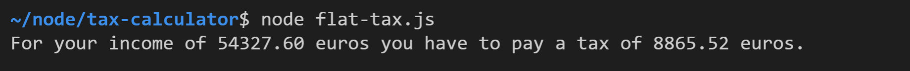
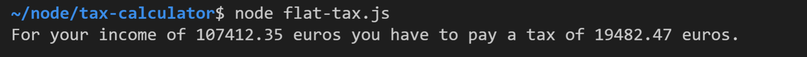
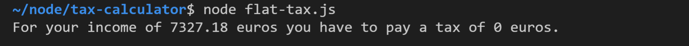
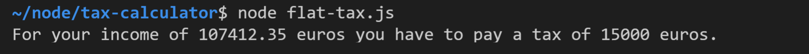
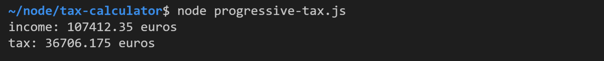
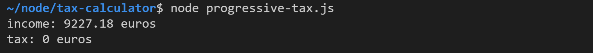
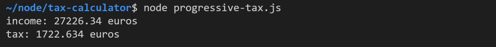
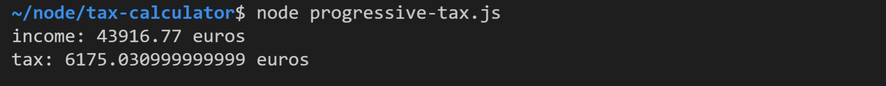
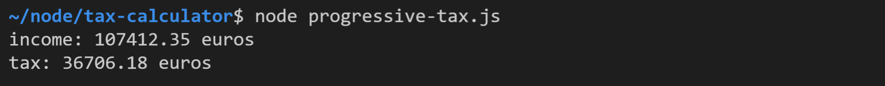
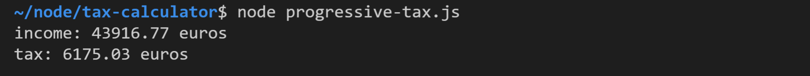

# Tax Calculator

## Task 1: Flat tax

Eine einstufiger Einkommensteuer wird als Flat Tax bezeichnet. In unserem Beispiel liegt diese bei 20%, wobei ein Steuerfreibetrag von 10000 Euro gilt (dieser Teil des Einkommens muss also nicht versteuert werden).

Erstellen Sie die Datei `flat-tax.js` und fügen Sie darin folgende Konstante ein:

```javascript
const incomeInput = '54327.60 euros';
```

Entwickeln Sie eine Anwendung zur Berechnung der Steuer. Die Ausgabe sollte folgendermaßen aussehen:



Weitere Testfälle (verändern Sie `incomeInput` entsprechend):





## Task 2: Capped flat tax

Passen Sie die Anwendung an, so dass höchstens eine Steuer von 15000 Euro zu bezahlen ist.

Die Ausgabe bei einem der obigen Testfälle sollte sich daher verändern:



Die anderen Testfälle sollten hingegen unverändert bleiben.

## Task 3: Progressive tax

Bei einer progressiven Einkommenssteuer erhöht sich der Steuersatz mit steigendem Einkommen. In unserem Beispiel gelten folgende Tarifstufen:

- für die ersten 10000 Euro werden keine Steuern eingehoben
- für die nächsten 20000 Euro gilt ein Steuersatz von 10%
- für die nächsten 20000 Euro gilt ein Steuersatz von 30%
- für alle darüber liegenden Beträge gilt ein Steuersatz von 50%

Erstellen Sie die Datei `progressive-tax.js` und fügen Sie darin folgende Konstante ein:

```javascript
const income = 107412.35;
```

Entwickeln Sie eine Anwendung zur Berechnung der Steuer. Die Ausgabe sollte folgendermaßen aussehen:



Weitere Testfälle:







## Task 4: Round to cents

Runden Sie die zu bezahlende Steuer mithilfe von `Math.round()` auf ganze Centbeträge.

Überprüfen Sie folgende Testfälle:




